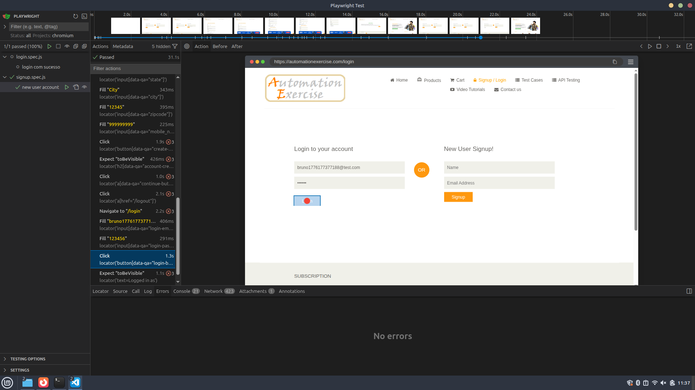

# Playwright Automation - E2E Testing

## 🇧🇷 Português

Projeto de QA focado na automação de testes end-to-end utilizando Playwright em uma aplicação real de e-commerce.

### Objetivo
Validar fluxos críticos de usuário simulando interações reais na interface, garantindo o comportamento esperado do sistema.

### Abordagem
O projeto foi construído com foco em cenários reais de uso, cobrindo o fluxo completo do usuário:

**Fase 1 — Fluxos principais**
- Cadastro de usuário (Signup)
- Login com credenciais válidas
- Execução de fluxo completo E2E

Durante a implementação, foram utilizados dados dinâmicos para evitar conflitos (ex: emails duplicados), simulando um ambiente mais próximo do real.

O projeto também evoluiu para uma estrutura modular, separando:
- Geração de dados (`helpers/user.js`)
- Ações reutilizáveis de autenticação (`helpers/authorization.js`)

---

### 🎥 Demonstração

#### Fluxo automatizado (GIF)

#### Execução do teste (Playwright UI)

---

### Observações de QA

Durante a automação, foi identificado um comportamento relevante na aplicação:

**Mixed Content (HTTPS)**  
A aplicação carrega recursos HTTP dentro de páginas HTTPS, o que resulta em:
- Requisições bloqueadas pelo navegador
- Possível impacto visual (ex: fontes não carregadas)
- Potencial risco de segurança

**Insight importante:**  
A automação não apenas valida fluxos funcionais, mas também expõe comportamentos que passam despercebidos em testes manuais.  
Nesse caso, o fluxo funciona normalmente para o usuário, mas o problema técnico só fica evidente ao observar logs e comportamento do navegador durante a execução automatizada.

---

## 🇺🇸 English

QA project focused on end-to-end test automation using Playwright on a real e-commerce web application.

### Objective
Validate critical user flows by simulating real user interactions and ensuring the expected system behavior.

### Approach
The project was built focusing on real-world scenarios, covering the full user journey:

**Phase 1 — Core flows**
- User signup
- Login with valid credentials
- Full E2E flow execution

Dynamic data (e.g., unique emails) was used to avoid conflicts and better simulate real environments.

The project also evolved into a modular structure, separating:
- Test data generation (`helpers/user.js`)
- Reusable authentication actions (`helpers/authorization.js`)

---

### 🎥 Demo

#### Automated flow (GIF)

#### Test execution (Playwright UI)

---

### QA Findings

During test execution, a relevant behavior was identified:

**Mixed Content (HTTPS)**  
The application loads HTTP resources inside HTTPS pages, which leads to:
- Requests blocked by the browser
- Potential UI impact (e.g., fonts not loading)
- Possible security risk

**Key insight:**  
Test automation not only validates functional flows but also helps uncover issues that may go unnoticed in manual testing.  
In this case, the user flow works as expected, but the underlying issue becomes visible through browser logs and automated execution analysis.